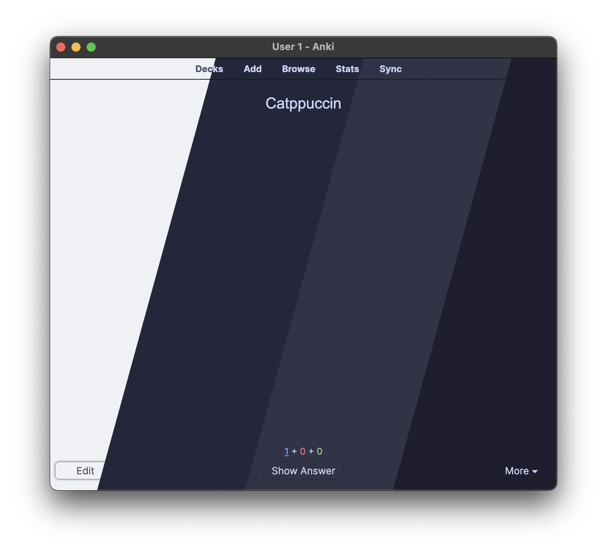

<h3 align="center">
	 
	
	Catppuccin for <a href="https://apps.ankiweb.net/">Anki</a>
	
</h3>

	
	
	

	

## ⚙️ Usage

### Method 1
1. Install the [ReColor add-on](https://ankiweb.net/shared/info/688199788) for Anki
	- Copy the code on the webpage.
	- In Anki, go to Tools > Addons > Get Addons and paste the code
2. Go into Tools > Addons > ReColor > Config > Advanced
3. Find the scheme you want [here](https://github.com/catppuccin/anki/tree/main/themes/) and copy the entire contents.
4. Paste them into the ReColor advanced config menu.

### Method 2
1. Clone this repository using `git clone https://github.com/catppuccin/anki`
2. Install the [ReColor add-on](https://ankiweb.net/shared/info/688199788) for Anki
	- Copy the code on the webpage.
	- In Anki, go to Tools > Addons > Get Addons and paste the code
3. Go into Tools > Addons > ReColor > View Files
4. Copy the themes directory from the anki repository into the ReColor files.
5. Go into Tools > Addons > ReColor > Config > Themes and choose latte, frappe, macchiato, or mocha

	
Plugins used in screenshot:

	<ul>
		<li>Ankicord - Discord RPC.</li>
		<li>Button Colours Good Again - Change button colors. </li>
		<li>Change Interface Font - Change interface font. (**Inter** for the screenshots) </li>
		<li>Clickable Tags v20 - Make tags clickable.</li>
    <li>CrowdAnki - Use decks hosted on the web.</li>
    <li>Custom Background Image and Gear Icon - Change the background image of Anki. (disabled in screenshot)</li>
    <li>Editor Live Preview - Generates a live preview of the card while in the editor.</li>
    <li>Image Occlusion Enchanced for Anki 21 - Converts images into questions using labels.</li>
    <li>More Decks Stats and Time Left - Advanced statistics.</li>
    <li>Quizlet to Anki 21 Importer with audio support - Import Quizlets and the TTS.</li>
    <li>ReColor - Theming the application.</li>
    <li>Review Heatmap - Show a Github-like heatmap of cards reviewed per day.</li>
    <li>True Retention - Shows retention rate for mature cards.</li>
    <li>Wrapper meta-addons - Adds custom buttons for adding wrapper tags in the editor.</li>
	</ul>

## 🙋 FAQ

-	Q: **_"Why isn't the theme working even after following the instructions?"_**\
	A: Try enabling/disabling dark mode in Anki's preferences, darker themes won't render properly in light mode.

## 💝 Thanks to

- [BlueFalconHD](https://github.com/bluefalconhd)
- [AnubisNekhet](https://github.com/AnubisNekhet)

&nbsp;

	

	Copyright &copy; 2021-present <a href="https://github.com/catppuccin" target="_blank">Catppuccin Org</a>

	

